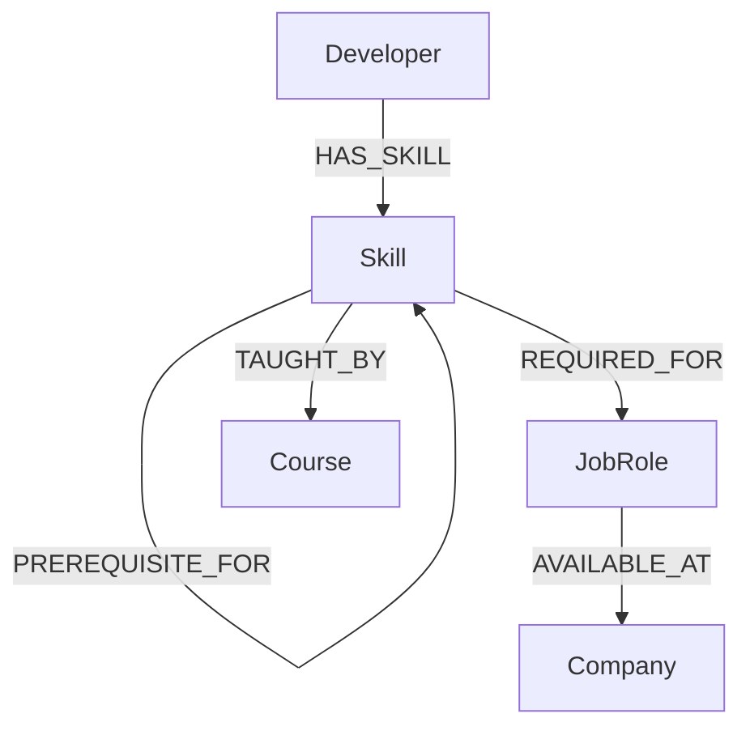

# CareerGraph

**Wexa AI Take-Home Assignment — CognoDB Graph Application**

CareerGraph helps users discover career paths from their existing technical skills, identify skill gaps, explore related skills, companies and learning resources, and visualize the relationships as a graph.

## Why a graph database?

Career discovery is relationship-heavy: a developer has skills, skills relate to other skills, skills are required by roles, roles are available at companies, and skills are taught by courses. A relational database can represent this with join tables, but graph traversal makes multi-hop relationship questions explicit and natural.

Example traversal:

`Developer → HAS_SKILL → Skill → RELATED_TO → Skill → REQUIRED_FOR → JobRole`

The application uses this traversal to discover career opportunities from a user's current skills.

## Data model



## Stack

- React + TypeScript + Vite
- Express + TypeScript
- Official `neo4j-driver`
- CognoDB Cloud over Bolt
- React Flow
- Plain CSS for a lightweight polished UI

## Setup

### 1. Create CognoDB

Go to https://console.cognodb.com/signup, create a free c0 instance, and save the generated password immediately.

### 2. Backend

```bash
cd backend
npm install
copy .env.example .env
```

On macOS/Linux use `cp .env.example .env`.

Set:

```env
COGNODB_URI=bolt+s://<instance-id>.databases.cognodb.cloud
COGNODB_USERNAME=cognodb
COGNODB_PASSWORD=<your-password>
PORT=3000
```

Seed:

```bash
npm run seed
```

Start:

```bash
npm run dev
```

### 3. Frontend

```bash
cd frontend
npm install
copy .env.example .env
npm run dev
```

Set `VITE_API_URL=http://localhost:3000`.

## Main queries

- Skills and careers: direct graph matches.
- Related skills: `Skill-[:RELATED_TO]->Skill`.
- Career discovery: `Skill-[:REQUIRED_FOR]->JobRole`.
- Multi-hop career discovery:
  `Developer-[:HAS_SKILL]->Skill-[:RELATED_TO]->Skill-[:REQUIRED_FOR]->JobRole`.
- Career graph: returns nodes and typed relationships for React Flow.
- Career matching: compares a developer's skills with a role's required skills.

All user-controlled Cypher values are parameters; no string-concatenated Cypher is used.

## API

`GET /api/health`  
`GET /api/skills`  
`GET /api/skills/:name`  
`GET /api/skills/:name/related`  
`GET /api/skills/:name/careers`  
`GET /api/careers`  
`GET /api/careers/:id`  
`GET /api/developers`  
`GET /api/developers/:id/matches`  
`GET /api/graph/career/:id`

## Screenshots

Place final screenshots in `/screenshots` before submission.

## Deployment

Frontend can be deployed to Vercel with `VITE_API_URL` pointing to the deployed backend. Keep CognoDB credentials only in backend environment variables.

## Demo recording

Recommended 3–5 minute flow: Dashboard → Skills → Career → Career matching → Graph Explorer → explain the multi-hop traversal.

## Security

Never commit `.env` or real CognoDB credentials.
